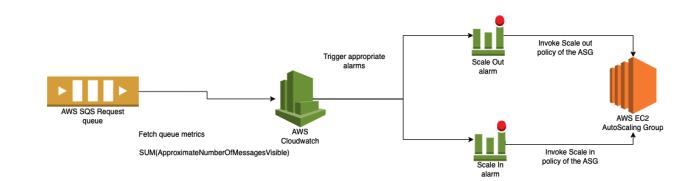

# AWSense : The Smart AWS Image Classifier

The main goal of this project is to create an IaaS solution utilizing AWS infrastructure for
hosting our image classification app. Our success criteria is the efficient scaling in and scaling
out of EC2 instances, which will run our image classification code, referred to as the app-tier.
The app-tier is already pre-configured with the necessary libraries and code for image
classification using deep learning, based on an AMI provided by the course instructor. Our
approach will involve integrating S3, SQS, and Cloudwatch to record and log the image
classification results, create events that will be consumed by the app-tier, and monitor the status
of auto scaling groups (ASG) and alarms. The aim is to optimize the app-tier to fully utilize the
resources available and enable it to classify a large number of images efficiently within a short
time frame.

Architecture:

The architecture of our application can be summarized in a high-level diagram. We have a
web-tier, which is responsible for hosting the API that sends images for classification. This layer
acts as the controller layer. When an image is sent for classification, it is added to the request
queue in AWS SQS, and the web-tier waits for the response in the response queue. The app-tier
instances fetch the request from the request queue and send it to the S3 input bucket, which acts
as the handler layer. The image is classified using the pre-installed code, which functions as the
data layer, and the output is sent to the request queue and the output bucket.
If there are many requests to be processed, we scale up (out) the app-tier instances, allowing for
parallel processing of multiple requests. The auto scaling group for the instance is configured to
limit the number of instances from 1 to 19. Cloudwatch alarms are set up to monitor the
thresholds for the instance, and if breached, we can increase or decrease the number of instances
accordingly.

Autoscaling:

Autoscaling is a critical component of our project, and we have implemented it using
Cloudwatch metrics, alarms, and a dynamic scaling policy linked to the auto scaling group. Our
approach is designed to ensure optimal use of AWS resources and minimize costs. Specifically,
when we encounter more than two requests, we initiate scaling out of instances. Conversely,
when the number of requests drops to less than three, we initiate scaling in instances.
The following diagram illustrates the flow of autoscaling:

The Cloudwatch metrics monitor the app-tier instances, and when the number of requests
exceeds a certain threshold, the Cloudwatch alarms are triggered. These alarms, in turn, initiate
scaling out of the instances through the dynamic scaling policy linked to the auto scaling group.
Similarly, when the number of requests drops below a certain threshold, the alarms trigger
scaling in of the instances. The scaling policies determine the specific number of instances to add
or remove, ensuring optimal use of AWS resources.

Testing and Evaluation:

To test our application, we used a Python script with a multithreaded generator to send 100
images concurrently to the web tier. These images were then queued in the request queue and
accessed by the app tier for processing. As the number of requests exceeded the threshold, the
app tier scaled out automatically, resulting in the creation of 19 instances using CloudWatch and
auto scaling group. Conversely, when the request queue was empty, the app tier scaled in
automatically, leaving only one running instance.
The outcome of each image classification was sent to the response queue, and the controller
retrieved and displayed the results. Additionally, both the images and their corresponding
outcomes were stored in S3 buckets for future use. Overall, this testing validated the scalability
and functionality of our application, demonstrating its ability to handle multiple requests
concurrently and effectively scale up and down as needed.

Code:

1. Web-Tier: The controller layer contains the "web.py" file, which exposes an API for
accepting input images, pushing them to the request queue, and waiting for processing by
the app tier. It also listens to the response queue for the corresponding output.
To install and run the web tier, follow these steps:
a. To install go to the folder and run
pip3 install -r requirements.txt #this command installs all the required
dependencies for to run the web-tier
b. To start the web server and hit the exposed api run
python3 web.py
c. Now using postman or thunder client extension in VS code hit the api.

2. Workload-generator: For automated testing of our infrastructure and code, we are using
a Python script named "workload-generator.py". This script does not require any
additional packages to be installed once the web tier is installed. To run this we type in:
python3 workload_generator.py --num_request 3 --url 'http://127.0.0.1:8081'
--image_folder "imagenet-100/"
To run a multithreaded workload generator we run:
python3 multithread_workload_generator.py --num_request 3 --url
'http://127.0.0.1:8081' --image_folder "imagenet-100/"

3. App-Tier: This is responsible for processing of the requests. It reads the requests from
the request queue, logs the input in an S3 input bucket, then it processes the image
through the image classification script given to us. Once processed it clears the message
from the request queue, puts it into the response queue and logs it into the S3 output
bucket for record keeping. To make sure this script is run automatically once the instance
is launched we have written a userdata script for the launch template which takes care of
it.

4. Userdata-script: This script is a multi-part script that includes two parts separated by the
boundary "//". The first part is a cloud-config script that sets up the instance with some
configuration details. The second part is a shell script that will be executed by the
instance's user data. This script first appends "Hello World" to the file "/tmp/testfile.txt",
lists the files in the directory to "/tmp/test2.txt", clones a GitHub repository using a
personal access token, installs the "boto3" Python package, and runs
"cloud-based-image-classifier-backend/index.py" script as the "ubuntu" user.

