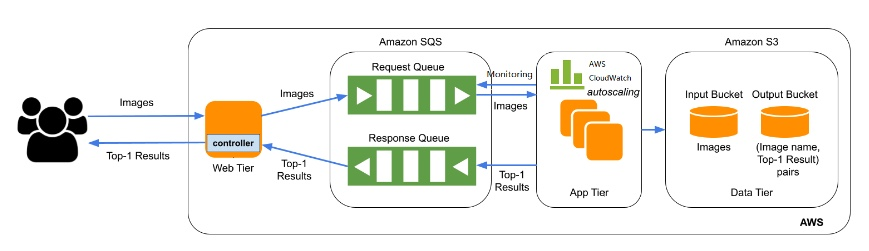

# AWSense : The Smart AWS Image Classifier

The main goal of this project is to create an IaaS solution utilizing AWS infrastructure for
hosting our image classification app. Our success criteria is the efficient scaling in and scaling
out of EC2 instances, which will run our image classification code, referred to as the app-tier.
The app-tier is already pre-configured with the necessary libraries and code for image
classification using deep learning, based on an AMI provided by the course instructor. Our
approach will involve integrating S3, SQS, and Cloudwatch to record and log the image
classification results, create events that will be consumed by the app-tier, and monitor the status
of auto scaling groups (ASG) and alarms. The aim is to optimize the app-tier to fully utilize the
resources available and enable it to classify a large number of images efficiently within a short
time frame.

Architecture:

